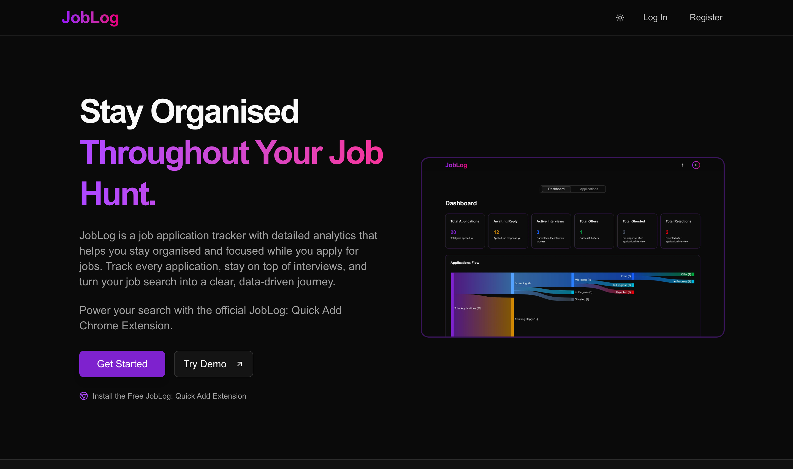
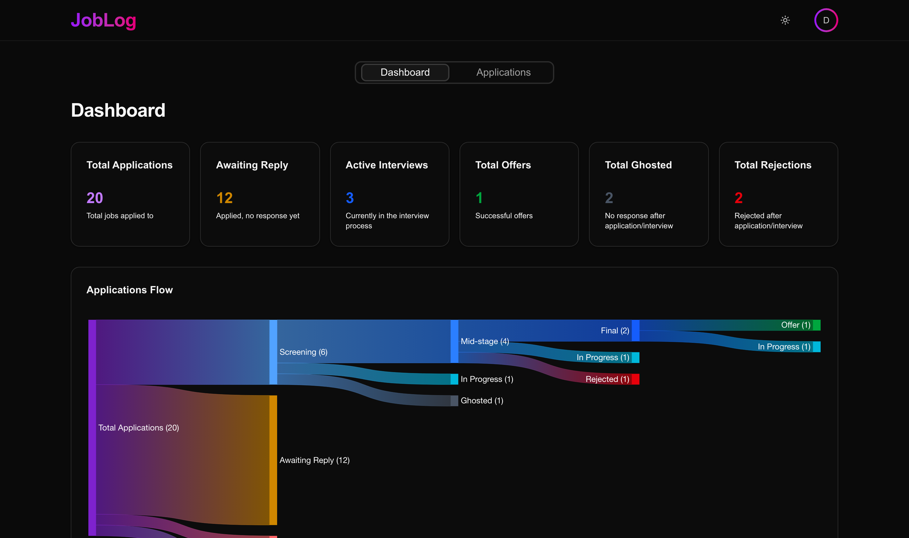
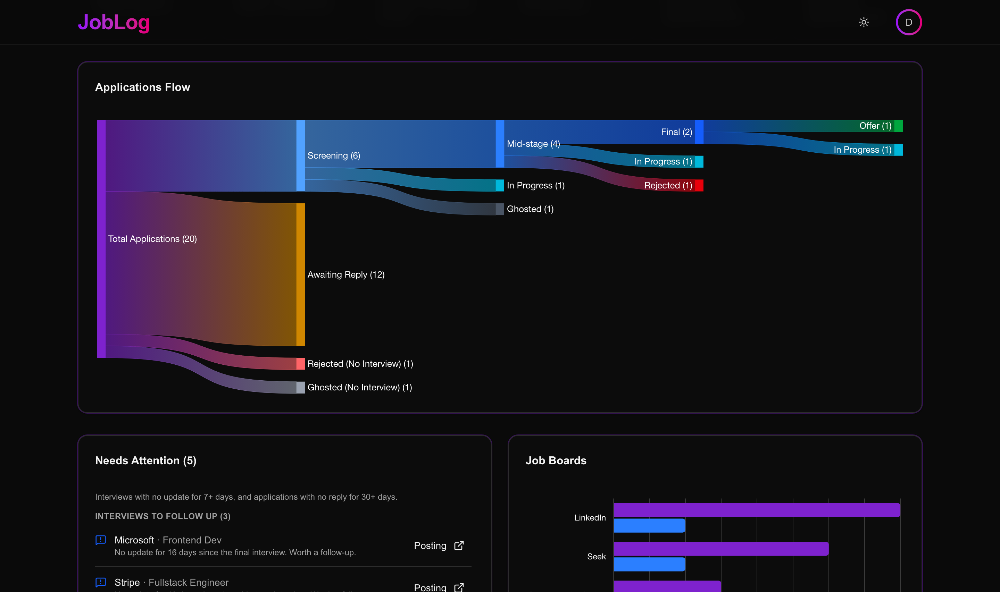
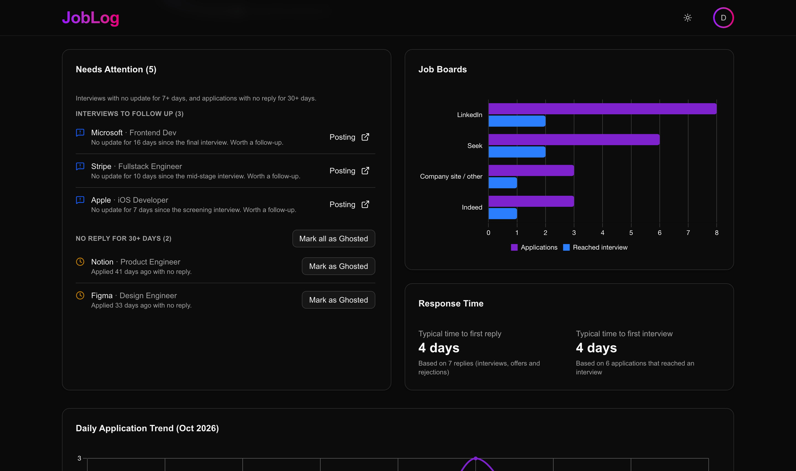
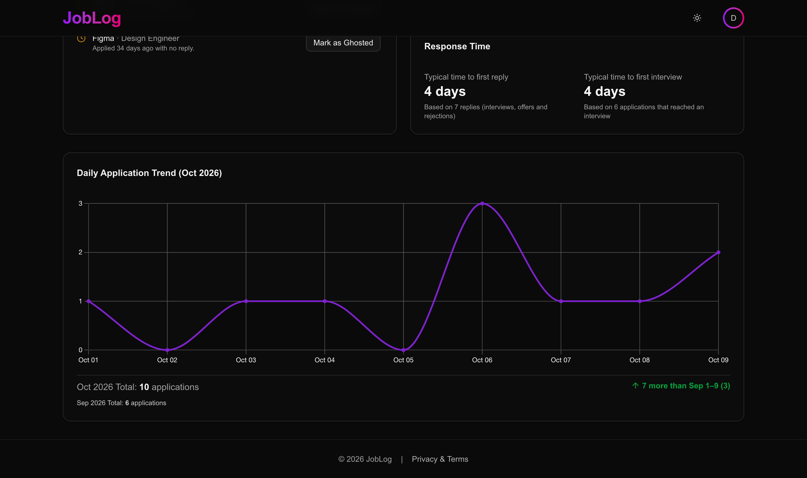
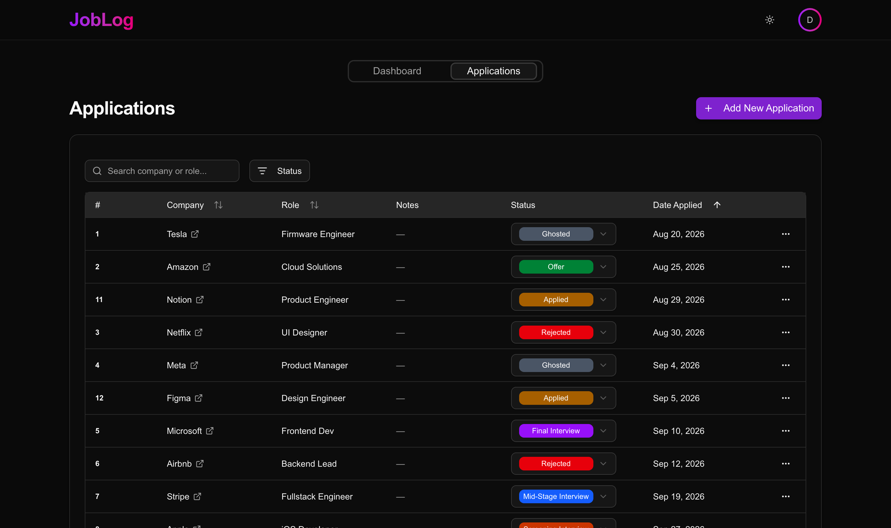
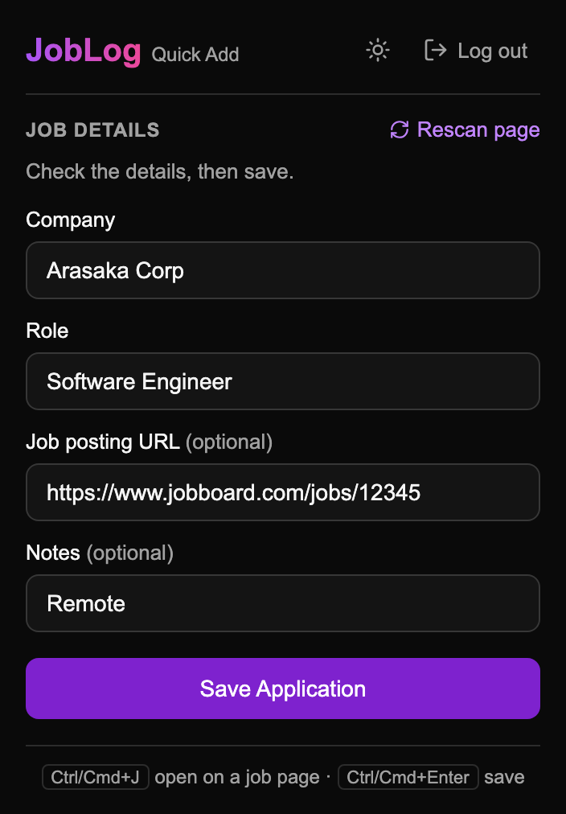
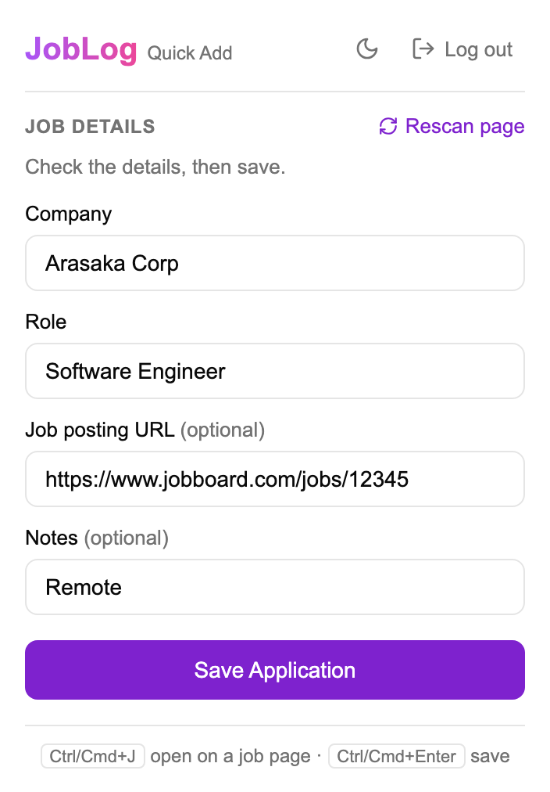

# JobLog: A Modern Job Application Tracker

[](https://reactjs.org/) [](https://www.typescriptlang.org/) [](https://nextjs.org/) [](https://ui.shadcn.com/) [](https://tailwindcss.com/) [](https://dotnet.microsoft.com/) [](https://dotnet.microsoft.com/) [](https://www.postgresql.org/) [](https://www.docker.com/) [](https://azure.microsoft.com/en-us/products/container-apps)	[](https://vercel.com/) [](https://docs.github.com/en/actions) [](https://chromewebstore.google.com/detail/mbbminokbdldbonjhceefnjncgadogcj?utm_source=item-share-cb) [](https://xunit.net/) 

[](https://github.com/athul-tmp/JobLog/actions/workflows/deploy-backend.yml)

JobLog is a full-stack web application for tracking job applications and monitoring job-search progress through structured data and visual analytics.
It is designed to provide clarity, organisation, and insights throughout the job application process.

🌐 **Live Site:** [https://joblog.athulthampan.com/](https://joblog.athulthampan.com/)

⚙️ **Browser Extension:** [Chrome Web Store](https://chromewebstore.google.com/detail/mbbminokbdldbonjhceefnjncgadogcj?utm_source=item-share-cb)

--- 

## 📔 Table of Contents

* [Features](#features)
* [Testing](#testing)
* [Screenshots](#screenshots)
* [Tech Stack](#tech-stack)
* [Infrastructure & Deployment](#infrastructure--deployment)
* [Project Structure](#project-structure)
* [Local Development Setup](#local-development-setup)
* [License](#license)
* [Developer](#developer)

---

## ✨ Features <a id="features"></a>

### Application Tracking
* **CRUD Operations:** Add, view, edit and delete job applications.
* **Status Timeline:** Every application keeps its full status history, shown as a timeline with the days between stages.
* **Data Organisation:** Sort by company, role, and date; search by role/company; and filter by status.
* **UI/UX:** Dedicated views for desktop (**TanStack Table**) and mobile (**Responsive card view**).

### Dashboard & Analytics
* **Key Metrics:** Track total applications, applications awaiting a reply, active interviews, offers, rejections and ghosted applications.
* **Applications Flow:** A Sankey chart following every application through Screening, Mid-stage and Final interviews, with outcomes shown where they happened.
* **Needs Attention:** Interviews with no update for 7+ days (worth a follow-up) and applications with no reply for 30+ days, with one-click or bulk "Mark as Ghosted".
* **Job Boards:** Applications and interviews per job board (LinkedIn, Seek, Indeed, company sites), worked out from the job posting link.
* **Response Time:** Typical number of days until a company first replies, and until a first interview.
* **Daily Trend:** Applications per day this month, compared against the same days of last month.
 
### Authentication & Security
* **Secure Identity:** Account registration with Brevo email verification.
* **Authentication:** Secure login using **HttpOnly JWT cookies**, with 30-day sessions that renew automatically while you're active.
* **Session Revocation:** Changing or resetting your password, or changing your email, signs out every existing session.
* **User Flows:** Robust password reset and email-change verification flows.
* **Security Standard:** Password hashing using **BCrypt**, per-IP **rate limiting** on login and email endpoints, and server-side input validation.
* **Demo Mode:** One click creates a private, temporary demo account seeded with sample applications (dated relative to today). Each visitor gets their own sandbox, account-changing actions are blocked server-side, and expired demo accounts are cleaned up automatically.

### Account Management
* **Settings:** Comprehensive settings for changing name, email, and password (all requiring current password/email verification).
* **Data Control:** Export all job applications (including status history) as CSV, clear all job applications and analytics data, and delete the account.

### Browser Extension (Quick Add)
* **Seamless Capture:** One-click scraping of job details (Company, Role, URL) from major boards like LinkedIn, Seek, and Indeed.
* **Secure Integration:** Directly communicates with the JobLog API using stored JWT tokens to log applications immediately, renewing the session whenever the popup opens.
* **Live Sync:** New applications added via the extension appear on the open Applications page without a manual refresh (SignalR).
* **Duplicate Warning:** Warns when a job has already been added, matching the posting's job ID across search and detail page URLs.
* **User Experience:** Styled to match the web app, with dark/light themes, keyboard shortcuts (Ctrl/Cmd+J to open, Ctrl/Cmd+Enter to save), sign-up and password reset links, and auto-closing on successful submission.

### UI / UX
* **Modern Design:** Built with **Tailwind CSS** and **shadcn/ui**.
* **Experience:** Fully responsive design (wide charts scroll sideways on phones), dark/light mode themes, and a landing page with a screenshot carousel and feature overview.
* **Getting Started:** New accounts see a short getting-started guide instead of empty charts.
* **Accessibility:** Status badges meet WCAG AA colour contrast.
* **Cold-Start Handling:** The landing page, login page and extension ping a health endpoint on load, so the serverless backend is already waking up by the time you log in.

---

## 🧪 Testing <a id="testing"></a>

The backend is covered by a suite of **96 automated tests** using **xUnit**, **Moq**, and the **EF Core In-Memory Provider**.

* **Unit Tests (48):** Cover core business logic across services, including status transition rules, JWT token generation, analytics calculations, and authentication logic, using mocked dependencies for full isolation.
* **Integration Tests (48):** Use `WebApplicationFactory` to exercise the full HTTP pipeline, including routing, JWT authentication, and controller behaviour, against a real (in-memory) database. Includes security tests for the demo account guard, input validation, rate limiting, session renewal and session revocation, plus per-visitor demo isolation and cleanup.
* **CI Pipeline:** Tests run automatically on every push via **GitHub Actions**, and gate production deployment. A failing test blocks the release.

Run the full suite locally:
```bash
dotnet test
```

---

## 📸 Screenshots <a id="screenshots"></a>

### Landing Page

The application's introduction, highlighting key features and providing access to the live demo or sign-up.

<div align="center">
  
</div>

### Dashboard

The analytics hub where you can visualise your job search.

**1. Overview**

The high-level summary of all activity: total applications, applications awaiting a reply, active interviews, offers, ghosted applications and rejections.

<div align="center">
  
</div>

<br>

**2. Applications Flow**

A Sankey diagram following every application from submission through Screening, Mid-stage and Final interviews, with each outcome shown at the stage where it happened.

<div align="center">
  
</div>

<br>

**3. Needs Attention, Job Boards & Response Time**

Interviews worth following up and long-unanswered applications (with one-click "Mark as Ghosted"), applications and interviews per job board, and how long companies typically take to reply.

<div align="center">
  
</div>

<br>

**4. Daily Application Trend**

Applications per day this month, compared against the same days of last month.

<div align="center">
  
</div>

### Application Tracker Page

The core table view for logging, managing, and quickly updating all job application details, statuses, and external links.

<div align="center">
  
</div>

### Browser Extension (Quick Add)

The extension popup, demonstrating successful data capture and theme responsiveness.

<div align="center">
  
  &nbsp;&nbsp;&nbsp;&nbsp;
  
</div>

---
## 💻 Tech Stack <a id="tech-stack"></a>

| Component | Technology | Highlights |
| :--- | :--- | :--- |
| **Frontend** | `Next.js` , `React`, `TypeScript` | Responsive UI with Zod validation, TanStack Table. |
| **Styling** | `Tailwind CSS`, `shadcn/ui` | Modern, utility-first styling. |
| **Backend** | `C# / ASP.NET Core 8.0` | RESTful Web API with SignalR for real-time updates. |
| **Database** | `PostgreSQL` (via EF Core) | Hosted on **Neon** (serverless PostgreSQL). |
| **Authentication** | `JWT` (HttpOnly Cookies), `BCrypt` | Sliding 30-day sessions with token-version revocation and secure password hashing. |
| **Email** | `Brevo` | Transactional email API for user verification and password reset flows. |
| **Extension** | `HTML`, `CSS`, `Vanilla JavaScript` | Browser-specific APIs (chrome.scripting, chrome.storage). |
| **Testing** | `xUnit, Moq, EF Core InMemory` | 96 tests (unit and integration), CI gated deployment. |

---

## ☁️ Infrastructure & Deployment <a id="infrastructure--deployment"></a>

* **Frontend:** Hosted on **Vercel**.
* **Backend:** Containerised and deployed on **Azure Container Apps**.
* **Database:** **Neon PostgreSQL**.
* **CI/CD:** Automated deployment via **GitHub Actions**. Pending EF Core migrations are applied to the production database (as a migrations bundle) before each new backend image goes live.
* **Domain:** Managed via **Cloudflare** for DNS.

---

## 📐 Project Structure <a id="project-structure"></a>

JobLog employs a monorepo structure with distinct layers for the frontend and backend, ensuring a clear separation of concerns and maintainability.

### Backend (`backend/`)
The **ASP.NET Core Web API** is organised using a layered architecture pattern:

| Directory | Purpose |
| :--- | :--- |
| `Controllers/` | **Entry Point:** Handles HTTP requests and delegates tasks. |
| `Hubs/` | **Real-Time:** SignalR hub for user-scoped job creation notifications. |
| `Services/` | **Business Logic:** Contains core application logic. |
| `Models/` | **Data Entities:** C# classes representing database tables (`User`, `JobApplication`, etc.). |
| `DTOs/` | **Data Transfer Objects:** Schemas used for API requests and responses. |
| `Data/` | **Database Context:** The Entity Framework Core `DbContext`. |
| `Migrations/` | **DB Changes:** Entity Framework Core database migration files. |
| `Helpers/` | **Cross-cutting:** Input validation, session handling, rate-limit policies and the demo account guard. |

<hr>

### Frontend (`frontend/src/`)
The **Next.js** application follows a clear pattern derived from the framework standards:

| Directory | Purpose |
| :--- | :--- |
| `pages/` | **Routing:** Maps files to routes (`/dashboard`, `/settings`, etc.). |
| `components/` | **UI Elements:** Reusable and page-specific UI components. |
| `context/` | **State Management:** Contains React Contexts for global state (e.g., `AuthContext`). |
| `hooks/` | **Logic:** Custom React hooks for reusable logic (e.g., `useStatusValidation`). |
| `services/` | **API Client:** Handles all communication and data fetching with the backend API. |
| `types/` | **TypeScript Definitions:** Interface and type declarations for data models. |
| `styles/` | Global CSS and Tailwind configuration. |

---

## ⚙️ Local Development Setup <a id="local-development-setup"></a>

For local development, JobLog uses **Docker Compose** to run the PostgreSQL database, while the backend API and frontend are run directly using their respective SDKs (`dotnet run` and `npm run dev`).

### Prerequisites
* [Node.js](https://nodejs.org/) (v18+)
* [.NET SDK](https://dotnet.microsoft.com/download) (v8.0)
* [Docker](https://www.docker.com/products/docker-desktop)

### Configuration
**The following configuration files are missing as they are git-ignored (for security) and must be created manually for local development:**

**Backend Configuration:** Create a file named `appsettings.Development.json` inside the `backend/` directory with your own values:

```json
{
  "ConnectionStrings": {
    "DefaultConnection": "Host=localhost;Port=5432;Database=JobLogDB;Username=username;Password=strongpassword"
  },
  "Jwt": {
    "Key": "a-long-random-secret-of-at-least-32-characters",
    "Issuer": "JobLog",
    "Audience": "JobLogUsers"
  },
  "Brevo": {
    "ApiKey": "your-brevo-api-key",
    "SenderEmail": "no-reply@example.com",
    "SenderName": "JobLog"
  },
  "FrontendUrl": "http://localhost:3000"
}
```

If the Brevo settings are left empty, no emails are sent, so registration and password-reset links won't arrive. Rate limits can optionally be tuned under `RateLimiting` (`AuthPermitLimit`, `EmailPermitLimit`, `GlobalPermitLimit`, `DemoPermitLimit`).

### 1. Start Database (via Docker Compose)

1.  Create a file named **`.env`** in the **project root** to define your PostgreSQL credentials, which Docker Compose uses to start the database service:
    ```env
    POSTGRES_USER=username
    POSTGRES_PASSWORD=strongpassword
    ```
2.  From the project root, start the database service defined in your `docker-compose.yml`:
    ```bash
    docker-compose up db
    ```
    *The database container will now be running in the background.*

### 2. Start Backend API (via .NET SDK)

1.  Navigate to the `backend` directory:
    ```bash
    cd backend
    ```
2.  Apply the database migrations (first run, and whenever new migrations are added):
    ```bash
    dotnet tool install --global dotnet-ef   # once
    dotnet ef database update
    ```
3.  Run the application using the .NET SDK:
    ```bash
    dotnet run
    ```
    *The API will start and connect to the Dockerised database.*

### 3. Start Frontend

1.  In a new terminal window, navigate to the `frontend` directory:
    ```bash
    cd frontend
    ```
2.  Install dependencies and start the Next.js development server:
    ```bash
    npm install
    npm run dev
    ```

The application will be accessible at `http://localhost:3000`.

### 4. Browser Extension Setup (Optional)

If you wish to test the browser extension locally:

1.  **Package:** Navigate to the extension directory (e.g., `extension/`) and ensure all necessary files (`manifest.json`, `popup.html`, `popup.js`, `images/`) are present.
2.  **Open Chrome Extensions:** Go to `chrome://extensions`.
3.  **Enable Developer Mode:** Toggle the switch in the top-right corner.
4.  **Load Unpacked:** Click the **"Load unpacked"** button and select the extension folder (e.g., `extension/`).
5.  **Testing:** The extension icon will appear. It talks to the live API by default; to use your local API, change the endpoint constants at the top of `popup.js`.

---
## 📃 License <a id="license"></a>

Copyright (c) 2025–2026 Athul Thampan.

This project is licensed under the [GNU Affero General Public License v3.0](./LICENSE) (AGPL-3.0). You're free to use, study and modify the code; if you run a modified version as a network service, you must make its source code available to its users under the same license.

Versions up to and including v1.8.0 were published under the MIT License.

---

## 👨‍💻 Developer <a id="developer"></a>

Athul Thampan | 🌐 [https://athulthampan.com](https://athulthampan.com)