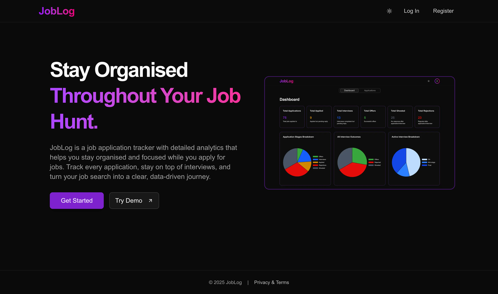
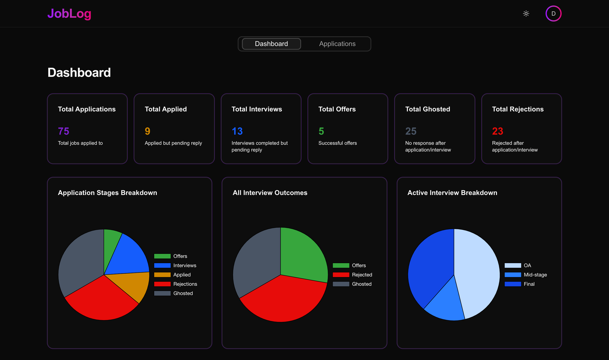
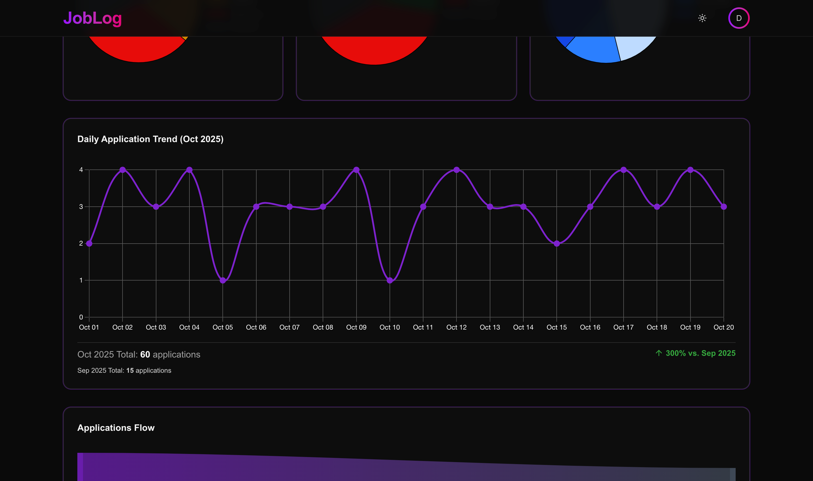
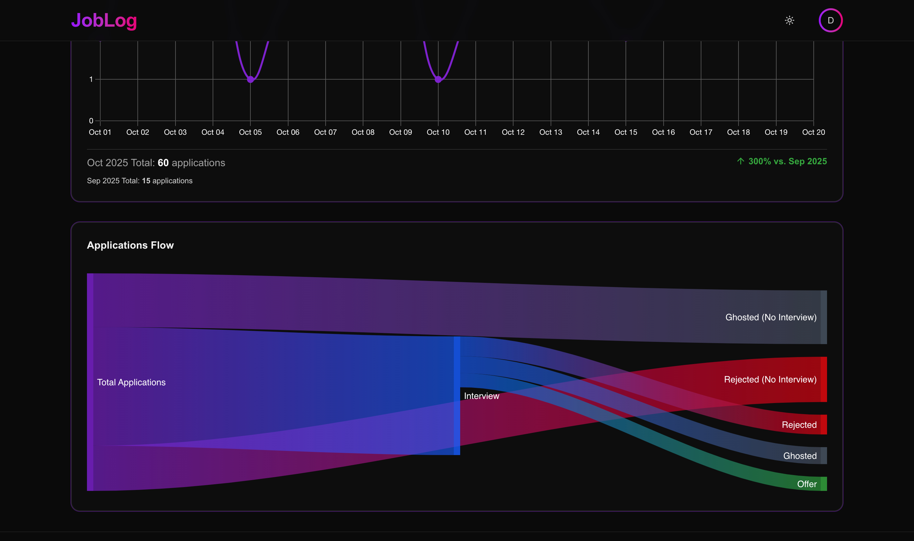
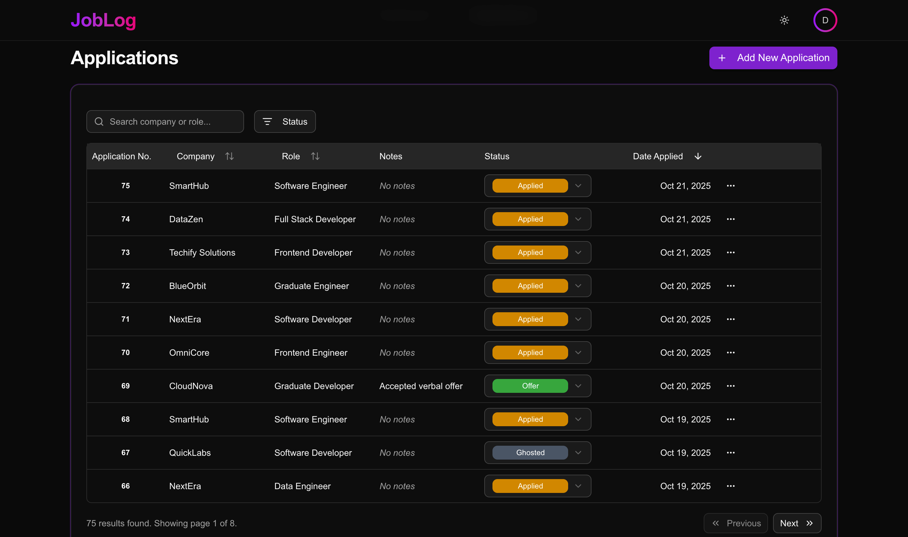

# JobLog: A Modern Job Application Tracker

[](https://reactjs.org/) [](https://www.typescriptlang.org/) [](https://nextjs.org/) [](https://ui.shadcn.com/) [](https://tailwindcss.com/) [](https://dotnet.microsoft.com/) [](https://dotnet.microsoft.com/) [](https://www.postgresql.org/) [](https://www.docker.com/) [](https://azure.microsoft.com/en-us/products/container-apps)	[](https://vercel.com/) [](https://docs.github.com/en/actions) []((https://chromewebstore.google.com/detail/mbbminokbdldbonjhceefnjncgadogcj?utm_source=item-share-cb))

JobLog is a full-stack web application for tracking job applications and monitoring job-search progress through structured data and visual analytics.
It is designed to provide clarity, organisation, and insights throughout the job application process.

🌐 **Live Site:** [https://joblog.athulthampan.com/](https://joblog.athulthampan.com/)

⚙️ **Browser Extension:** [Chrome Web Store](https://chromewebstore.google.com/detail/mbbminokbdldbonjhceefnjncgadogcj?utm_source=item-share-cb)

--- 

## 📔 Table of Contents

* [Features](#features)
* [Screenshots](#screenshots)
* [Tech Stack](#tech-stack)
* [Infrastructure & Deployment](#infrastructure--deployment)
* [Project Structure](#project-structure)
* [Local Development Setup](#local-development-setup)
* [Planned Enhancement](#planned-enhancement)
* [License](#license)
* [Developer](#developer)

---

## ✨ Features <a id="features"></a>

### Application Tracking
* **CRUD Operations:** Easily add, edit, and view all job applications.
* **Data Organisation:** Sort by company, role, and date; search by role/company; and filter by status.
* **UI/UX:** Dedicated views for desktop (**TanStack Table**) and mobile (**Responsive card view**).

### Dashboard & Analytics
* **Key Metrics:** Track total applications, offers, rejections, interviews, etc.
* **Visual Insights:**
    * Active Interview Type Breakdown, Past Interview Type Breakdown and Interview Outcomes (Chart.js Pie Charts).
    * Daily Application Trend Line Chart with monthly comparison.
    * Application Flow Visualisation (Google Charts Sankey).
 
### Authentication & Security
* **Secure Identity:** Account registration with Brevo SMTP email verification.
* **Authentication:** Secure login using **HttpOnly JWT cookies**.
* **User Flows:** Robust password reset and email-change verification flows.
* **Security Standard:** Password hashing using **BCrypt**.
* **Demo Mode:** Public, session based demo account available with automatic data reset.

### Account Management
* **Settings:** Comprehensive settings for changing name, email, and password (all requiring current password/email verification).
* **Data Control:** Option to clear all job applications and analytics data, and delete the account.

### Browser Extension (Quick Add)
* **Seamless Capture:** One-click scraping of job details (Company, Role, URL) from major boards like LinkedIn, Seek, and Indeed.
* **Secure Integration:** Directly communicates with the JobLog API using stored JWT tokens to log applications immediately.
* **User Experience:** Includes theme syncing (Dark/Light Mode) and auto-closing on successful submission.

### UI / UX
* **Modern Design:** Built with **Tailwind CSS** and **shadcn/ui**.
* **Experience:** Fully responsive design, dark/light mode themes, and a landing-page screenshot carousel.

---

## 📸 Screenshots <a id="screenshots"></a>

### Landing Page

The application's introduction, highlighting key features and providing access to the live demo or sign-up.

<div align="center">
  
</div>

### Dashboard

The analytics hub where you can visualise your job search.

**1. Key metrics, Stages, & Outcomes**

The high-level summary of all activity, coupled with interview stage breakdowns and interview outcomes.

<div align="center">
  
</div>

<br>

**2. Daily Application Trend**

A line chart showing the consistency of your daily application efforts compared to previous periods.

<div align="center">
  
</div>

<br>

**3. Application Flow**

A Sankey diagram illustrating how applications transition through the pipeline from initial submission to final status.

<div align="center">
  
</div>

### Application Tracker Page

The core table view for logging, managing, and quickly updating all job application details, statuses, and external links.

<div align="center">
  
</div>

### Browser Extension (Quick Add)

The extension popup, demonstrating successful data capture and theme responsiveness.

<div align="center">
  
  &nbsp;&nbsp;&nbsp;&nbsp;
  
</div>

---
## 💻 Tech Stack <a id="tech-stack"></a>

| Component | Technology | Highlights |
| :--- | :--- | :--- |
| **Frontend** | `Next.js` , `React`, `TypeScript` | Responsive UI with Zod validation, TanStack Table. |
| **Styling** | `Tailwind CSS`, `shadcn/ui` | Modern, utility-first styling. |
| **Backend** | `C# / ASP.NET Core 8.0` | RESTful Web API. |
| **Database** | `PostgreSQL` (via EF Core) | Hosted on **Neon** (serverless PostgreSQL). |
| **Authentication** | `JWT` (HttpOnly Cookies), `BCrypt` | Stateless API with secure password hashing. |
| **Email** | `Brevo SMTP` | For user verification and password reset flows. |
| **Extension** | `HTML`, `CSS`, `Vanilla JavaScript` | Browser-specific APIs (chrome.scripting, chrome.storage). |

---

## ☁️ Infrastructure & Deployment <a id="infrastructure--deployment"></a>

* **Frontend:** Hosted on **Vercel**.
* **Backend:** Containerised and deployed on **Azure Container Apps**.
* **Database:** **Neon PostgreSQL**.
* **CI/CD:** Automated deployment via **GitHub Actions**.
* **Domain:** Managed via **Cloudflare** for DNS.

---

## 📐 Project Structure <a id="project-structure"></a>

JobLog employs a monorepo structure with distinct layers for the frontend and backend, ensuring a clear separation of concerns and maintainability.

### Backend (`backend/`)
The **ASP.NET Core Web API** is organised using a layered architecture pattern:

| Directory | Purpose |
| :--- | :--- |
| `Controllers/` | **Entry Point:** Handles HTTP requests and delegates tasks. |
| `Services/` | **Business Logic:** Contains core application logic. |
| `Models/` | **Data Entities:** C# classes representing database tables (`User`, `JobApplication`, etc.). |
| `DTOs/` | **Data Transfer Objects:** Schemas used for API requests and responses. |
| `Data/` | **Database Context:** The Entity Framework Core `DbContext`. |
| `Migrations/` | **DB Changes:** Entity Framework Core database migration files. |
| `Helpers/` | Utility functions for tasks like password validation. |

<hr>

### Frontend (`frontend/src/`)
The **Next.js** application follows a clear pattern derived from the framework standards:

| Directory | Purpose |
| :--- | :--- |
| `pages/` | **Routing:** Maps files to routes (`/dashboard`, `/settings`, etc.). |
| `components/` | **UI Elements:** Reusable and page-specific UI components. |
| `context/` | **State Management:** Contains React Contexts for global state (e.g., `AuthContext`). |
| `hooks/` | **Logic:** Custom React hooks for reusable logic (e.g., `useStatusValidation`). |
| `services/` | **API Client:** Handles all communication and data fetching with the backend API. |
| `types/` | **TypeScript Definitions:** Interface and type declarations for data models. |
| `styles/` | Global CSS and Tailwind configuration. |

---

## ⚙️ Local Development Setup <a id="local-development-setup"></a>

For local development, JobLog uses **Docker Compose** to run the PostgreSQL database, while the backend API and frontend are run directly using their respective SDKs (`dotnet run` and `npm run dev`).

### Prerequisites
* [Node.js](https://nodejs.org/) (v18+)
* [.NET SDK](https://dotnet.microsoft.com/download) (v8.0)
* [Docker](https://www.docker.com/products/docker-desktop)

### Configuration
**The following configuration files are missing as they are git-ignored (for security) and must be created manually for local development:**

**Backend Configuration:** Create a file named `appsettings.Development.json` inside the `backend/` directory. This file must be populated with placeholders for your required settings (JWT secret key, Email Service API details, etc.).

### 1. Start Database (via Docker Compose)

1.  Create a file named **`.env`** in the **project root** to define your PostgreSQL credentials, which Docker Compose uses to start the database service:
    ```env
    POSTGRES_USER=username
    POSTGRES_PASSWORD=strongpassword
    ```
2.  From the project root, start the database service defined in your `docker-compose.yml`:
    ```bash
    docker-compose up db
    ```
    *The database container will now be running in the background.*

### 2. Start Backend API (via .NET SDK)

1.  Navigate to the `backend` directory:
    ```bash
    cd backend
    ```
2.  Run the application using the .NET SDK:
    ```bash
    dotnet run
    ```
    *The API will start and automatically apply any pending EF Core database migrations, connecting to the Dockerised database.*

### 3. Start Frontend

1.  In a new terminal window, navigate to the `frontend` directory:
    ```bash
    cd frontend
    ```
2.  Install dependencies and start the Next.js development server:
    ```bash
    npm install
    npm run dev
    ```

The application will be accessible at `http://localhost:3000`.

### 4. Browser Extension Setup (Optional)

If you wish to test the browser extension locally:

1.  **Package:** Navigate to the extension directory (e.g., `extension/`) and ensure all necessary files (`manifest.json`, `popup.html`, `popup.js`, `images/`) are present.
2.  **Open Chrome Extensions:** Go to `chrome://extensions`.
3.  **Enable Developer Mode:** Toggle the switch in the top-right corner.
4.  **Load Unpacked:** Click the **"Load unpacked"** button and select the extension folder (e.g., `extension/`).
5.  **Testing:** The extension icon will appear. It is now running against your local or live API endpoints defined in `popup.js`.

---
## 📃 License <a id="license"></a>

This project is licensed under the [MIT License](./LICENSE).

---

## 👨‍💻 Developer <a id="developer"></a>

Athul Thampan | 🌐 [https://athulthampan.com](https://athulthampan.com)
